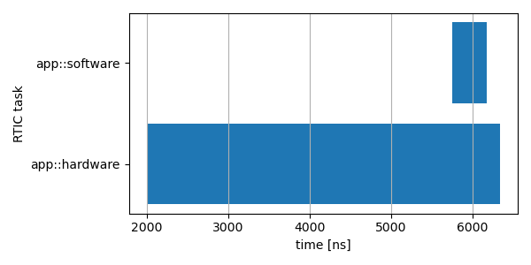

RTIC Scope application example
---

This repository is an application example of [RTIC Scope](https://github.com/rtic-scope) v0.3 on a Microchip ATSAME51N20A MCU running a trivial [RTIC](https://rtic.rs) application.
The SWO pin of the MCU is used to asynchronously exfiltrate the trace stream from the device.
It it assumed that the serial communication (NRZ) on this SWO pin is exposed as a serial device on your (Linux) host system.

The application configures tracing via `cortex_m_rtic_trace::{configure, trace}` and pends a `app::hardware` task.
This hardware task spawns a software task, `app::software`, with higher priority that instantly exits.
Both tasks are traced.

## Installing RTIC Scope
Install the toolset via
```
$ cargo install --git https://github.com/rtic-scope/cargo-rtic-scope  --branch v0.3.x cargo-rtic-scope rtic-scope-frontend-dummy
```

It is also recommended to install `itm-decode` for debugging purposes:
```
$ cargo install --git https://github.com/rtic-scope/itm --branch v0.8.x itm-decode
```

## Preparing the target
Attach to the target via `openocd` or equivalent:
```
$ openocd -f openocd.cfg
```

Flash the target via `arm-none-eabi-gdb` or equivalent (adapt `runner` in `.cargo/config` for your system):
```
$ cargo run
[...]
(gdb) continue
Program received signal SIGTRAP, Trace/breakpoint trap.
[...]
(gdb) frame 2
#2  rtic_scope_atsame_example::app::init (ctx=...) at src/main.rs:41
41              cortex_m::asm::bkpt(); // interactive escape from SWO pin transient
(gdb)
```

## Testing the communication with `itm-decode` (optional)
The flashed application configures the trace subsystem so communicate with a baud rate of 1000000 Bps, via
```rust
// configure tracing
cortex_m_rtic_trace::configure(
    ..,
    &TraceConfiguration {
        ..,
        tpiu_baud: 1_000_000, // B/s
    },
)
.unwrap();
```

Logically, we use the same baud rate on the host:
```
$ itm-decode /path/to/dev/tty --itm-freq 1000000
```
After which we resume execution on the device:
```
(gdb) continue
```
which yields
```
ExceptionTrace { exception: Interrupt { irqn: 12 }, action: Entered }
ExceptionTrace { exception: Interrupt { irqn: 13 }, action: Entered }
LocalTimestamp1 { ts: 24, data_relation: Sync }
DataTraceValue { comparator: 1, access_type: Write, value: [0] }
LocalTimestamp1 { ts: 45, data_relation: Sync }
DataTraceValue { comparator: 2, access_type: Write, value: [0] }
ExceptionTrace { exception: Interrupt { irqn: 13 }, action: Exited }
LocalTimestamp2 { ts: 5 }
ExceptionTrace { exception: Interrupt { irqn: 12 }, action: Returned }
ExceptionTrace { exception: Interrupt { irqn: 12 }, action: Exited }
LocalTimestamp2 { ts: 2 }
ExceptionTrace { exception: ThreadMode, action: Returned }
```

With a verified connection, we continue with RTIC Scope proper after first resetting the target:
```
(gdb) reflash
(gdb) continue
Program received signal SIGTRAP, Trace/breakpoint trap.
[...]
(gdb) frame 2
#2  rtic_scope_atsame_example::app::init (ctx=...) at src/main.rs:41
41              cortex_m::asm::bkpt(); // interactive escape from SWO pin transient
(gdb)
```

## Recording a trace with `cargo rtic-scope trace`
RTIC Scope resolves the RTIC tasks responsible for the emission of the `ExceptionTrace`s and `DataTraceValue`s above, but requires user-supplied metadata in order to do so.
This metadata is provided in a metadata block in `Cargo.toml`:
```toml
[package.metadata.rtic-scope]
pac_name = "atsamd51n"                  # Crate in which the Interrupt enum lives. Used for hardware task resolving.
pac_features = []
pac_version = "0.11"
interrupt_path = "atsamd51n::Interrupt" # Module path to the Interrupt enum.
tpiu_freq = 12000000                    # Frequency of the clock sourcing the TPIU perhipheral
tpiu_baud = 1000000                     # Target-side SWO baud rate
dwt_enter_id = 1                        # DWT comparator ID for software task enter events
dwt_exit_id = 2                         # DWT comparator ID for software task exit events
lts_prescaler = 1                       # The prescaler for local (delta) timestamps
expect_malformed = false                # We do not expect malformed trace packets in the stream. Used for debugging purposes. To be deprecated in a future release.
```
This metadata should match the call to `cortex_m_rtic_trace::configure`:
```rust
// configure tracing
cortex_m_rtic_trace::configure(
    &mut ctx.core.DCB,
    &mut ctx.core.TPIU,
    &mut ctx.core.DWT,
    &mut ctx.core.ITM,
    1, // task enter DWT comparator ID
    2, // task exit DWT comparator ID
    &TraceConfiguration {
        delta_timestamps: LocalTimestampOptions::Enabled, // enabled with a bypassed (= 1) prescaler
        absolute_timestamps: GlobalTimestampOptions::Disabled, // disable absolute timestamps
        timestamp_clk_src: TimestampClkSrc::AsyncTPIU,
        tpiu_freq: freq, // Hz
        tpiu_baud: 1_000_000, // B/s
        protocol: TraceProtocol::AsyncSWONRZ,
    },
)
.unwrap();
```

With the metadata supplied, we start recording the trace:
```
$ cargo rtic-scope trace --serial /path/to/dev/tty --dont-touch-target
    Building RTIC target application...
  Recovering metadata for rtic-scope-atsame-example (/path/to/rtic-scope-atsame-example/src/main.rs)...
   Recovered 2 task(s) from rtic-scope-atsame-example: 1 hard, 1 soft.
[...]
```
resume target execution:
```
(gdb) continue
```
and send SIGINT (`<C-c>`) after 10 seconds which ends the recording, yielding
```
    Frontend dummy: @2000 ns (+2000 ns) [good]: [Task { name: "app::hardware", action: Entered }]
    Frontend dummy: @5750 ns (+3750 ns) [good]: [Task { name: "app::software", action: Entered }]
    Frontend dummy: @6167 ns (+417 ns) [good]: [Task { name: "app::software", action: Exited }]
    Frontend dummy: @6334 ns (+167 ns) [good]: [Task { name: "app::hardware", action: Returned }, Task { name: "app::hardware", action: Exited }]
      Traced rtic-scope-atsame-example: 10 packets processed in 10s (~1.0 packets/s; 0 malformed, 0 non-mappable); 2/2 sinks operational.
```

## Replaying a trace with `cargo rtic-scope replay`
With a trace recorded we can now replay it offline for post-mortem analysis.
All recorded traces can be listed via
```
$ cargo rtic-scope replay --list
0       /path/to/rtic-scope-atsame-example/target/rtic-traces/rtic-scope-atsame-example-gf7dd449-dirty-2022-03-21T11:16:31.trace
```
By use of the index on the left-hand side we replay the trace:
```
$ cargo rtic-scope replay 0
    Frontend dummy: @2000 ns (+2000 ns) [good]: [Task { name: "app::hardware", action: Entered }]
    Frontend dummy: @5750 ns (+3750 ns) [good]: [Task { name: "app::software", action: Entered }]
    Frontend dummy: @6167 ns (+417 ns) [good]: [Task { name: "app::software", action: Exited }]
    Frontend dummy: @6334 ns (+167 ns) [good]: [Task { name: "app::hardware", action: Returned }, Task { name: "app::hardware", action: Exited }]
    Replayed rtic-scope-atsame-example: 10 packets processed in 0s (~inf packets/s; 0 malformed, 0 non-mappable); 1/1 sinks operational.
```
A trace can also be selected via `replay --trace-file /path/to/rtic-scope-atsame-example-*.trace`.

## Graphically plotting the recorded trace with the `feat/auto-plot` fork
An experimental fork of `rtic-scope-frontend-dummy` can plot the run-time of the two traces tasks using `pandas` and `matplotlib.pyplot` for Python 3:
```
$ cargo install --git https://github.com/rtic-scope/cargo-rtic-scope --branch feat/auto-plot rtic-scope-frontend-dummy
$ cargo rtic-scope replay 0
```
which produces the plot seen below, in which `app::software` preempts `app::hardware`:



Note that `app::software` does fake work for 100 ms:
```rust
#[trace]
#[task(priority = 2, local = [delay])]
fn software(ctx: software::Context) {
    ctx.local.delay.delay_ms(100_u8); // fake work
}
```
so the timestamps both in the plot and recorded trace is wildly incorrect.
This discrepancy has yet to be investigated.

---

Related issue: [#139](https://github.com/rtic-scope/cargo-rtic-scope/issues/139).
